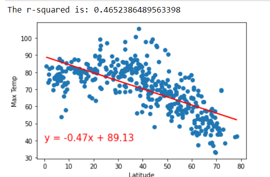
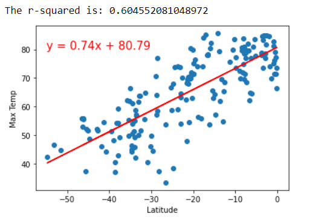
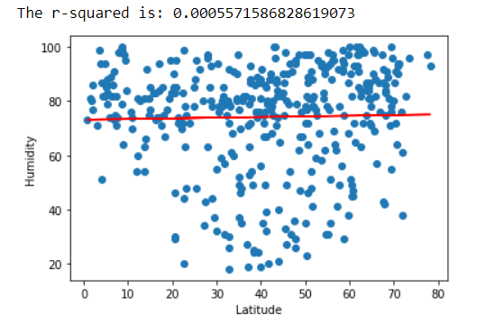
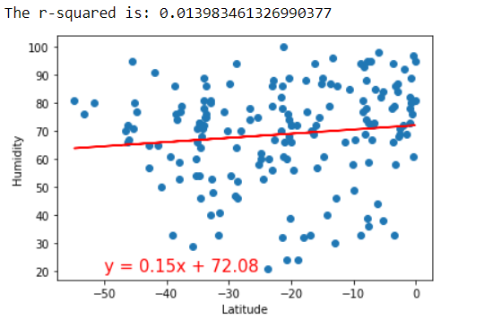
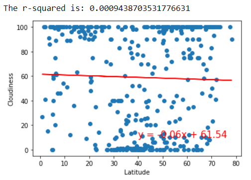
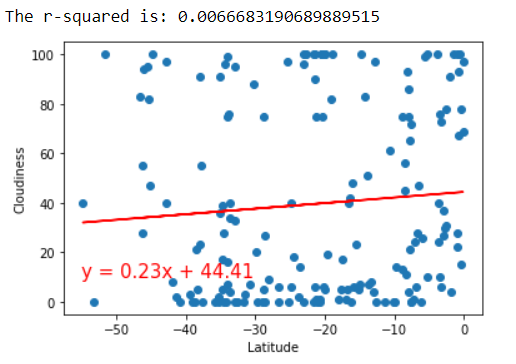
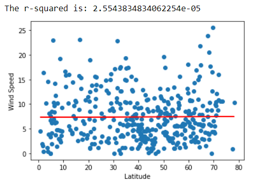

# Python API Project

## Overview

Using g_key and OpenWeather key, I created a Python script to visualize the weather of 500+ cities across the world of varying distance from the equator.I utilized a simple Python library, the OpenWeatherMap API, and also create a representative model of weather across world cities.

### Part I - WeatherPy

1. Uploaded cities CSV files. 
2. Created random latitude and long combinations to add these cities are unique, add those to our list.
3. Found the weather for these cities using OpenWeatherMap API.
4. Converted these citydata to dataframe.
5. Inspected the data and removed the cities where the humidity > 100% and cleaned up the data if there is null cells. 
6. Exported the clean data into a CSV file. 
7. After clean up the data, created serious of scatter plots to show the relation between Latitude and Cloudiness, Humidity, Temperature and Wind Speed. 

* Cloudiness (%) vs. Latitude, very spread out plot, no specific outcome.
* Humidity (%) vs. Latitude, very spread out plot, no specific outcome.
* Temperature (F) vs. Latitude, bell curve plot, normal distrubition closer to the latitude 0 it is getting hot. 
* Cloudiness (%) vs. Latitude, bell curve plot, normal distrubition closer to the 
* Wind Speed (mph) vs. Latitude, very spread out plot, no specific outcome.

#### Latitude vs. Cloudiness Plot

#### Latitude vs. Humidity Plot

#### Latitude vs. Temperature Plot.png

#### Latitude vs. Wind Speed Plot

Run linear regression on each relationship. This time, separate the plots into Northern Hemisphere (greater than or equal to 0 degrees latitude) and Southern Hemisphere (less than 0 degrees latitude):

* Northern Hemisphere - Temperature (F) vs. Latitude, there is a negative correlation. 

* Southern Hemisphere - Temperature (F) vs. Latitude, there is a positive correlation. 

 
* Northern Hemisphere - Humidity (%) vs. Latitude, there is no correlation in between these variables. 

* Southern Hemisphere - Humidity (%) vs. Latitude, there is minor positive correlation in between these variables. 

* Northern Hemisphere - Cloudiness (%) vs. Latitude,there is minor negative correlation in between these variables. 

* Southern Hemisphere - Cloudiness (%) vs. Latitude, there is minor positive correlation in between these variables. 

* Northern Hemisphere - Wind Speed (mph) vs. Latitude, there is no correlation in between these variables. 

* Southern Hemisphere - Wind Speed (mph) vs. Latitude, there is minor negative correlation in between these variables. 

### Part II - VacationPy

* Used exported clean data from weatherpy, configured as gmaps and created location variables.
* After cleanup the data and created dataframe between 80 to 70 temp , added heatmap layer to map. 
* Narrowed the cities and found the hotels with 5000 meters using nearbyseach including hotel name, city and country. 
* Used Google Places API for each city's coordinates and plot them on the heatmap. 

#### Heatmap
  

#### Hotel Map

