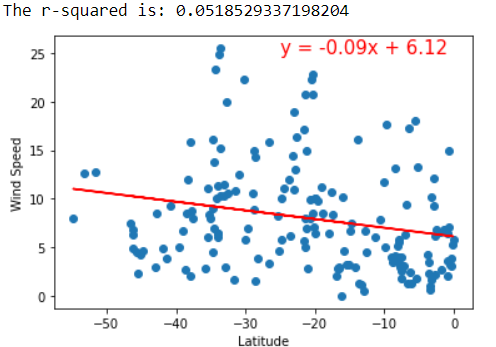

# Python API Project

## Overview

Using g_key and OpenWeather key, I created a Python script to visualize the weather of 500+ cities across the world of varying distance from the equator.I utilized a simple Python library, the OpenWeatherMap API, and also create a representative model of weather across world cities.

### Part I - WeatherPy

Serious of scatter plots created to show the relation between Latitude and Cloudiness, Humidity, Temperature and Wind Speed. 

* Temperature (F) vs. Latitude
* Humidity (%) vs. Latitude
* Cloudiness (%) vs. Latitude
* Wind Speed (mph) vs. Latitude

#### Latitude vs. Cloudiness Plot

#### Latitude vs. Humidity Plot

#### Latitude vs. Temperature Plot.png

#### Latitude vs. Wind Speed Plot

Run linear regression on each relationship. This time, separate the plots into Northern Hemisphere (greater than or equal to 0 degrees latitude) and Southern Hemisphere (less than 0 degrees latitude):

* Northern Hemisphere - Temperature (F) vs. Latitude

* Southern Hemisphere - Temperature (F) vs. Latitude
 
* Northern Hemisphere - Humidity (%) vs. Latitude

* Southern Hemisphere - Humidity (%) vs. Latitude

* Northern Hemisphere - Cloudiness (%) vs. Latitude

* Southern Hemisphere - Cloudiness (%) vs. Latitude

* Northern Hemisphere - Wind Speed (mph) vs. Latitude

* Southern Hemisphere - Wind Speed (mph) vs. Latitude

### Part II - VacationPy

Used exported data from weatherpy and configured as gmaps. After cleanup the data, added heatmap layer to map. Narrowed the cities and found the hotels with 5000 meters. Used Google Places API for each city's coordinates and plot them on the heatmap. 

#### Heatmap
  

#### Hotel Map

